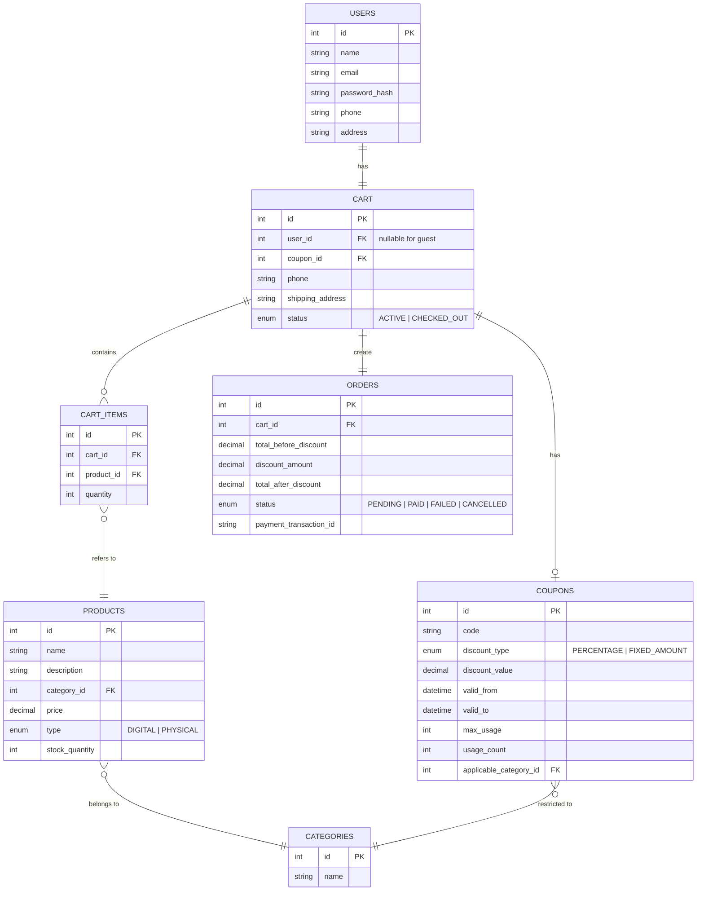

# วิเคราะห์และออกแบบจากความต้องการของลูกค้า

> **หมายเหตุ**
> 1. สามารถใช้เครื่องมือที่ถนัดในการเขียน diagram ได้ (ไม่จำเป็นต้องเขียนเป็น mermaid syntax ตามตัวอย่าง)
> 2. สามารถแนบไฟล์รูปเข้าไปในโฟลเดอร์ `Exam03` ได้ และใช้ markdown syntax อธิบายรูปประกอบการตอบคำถาม

## 1.จะออกแบบ REST API อย่างไร

แบ่ง API ตามหัวข้อของความต้องการในโจทย์ที่ระบุไว้ จะมีทั้งหมด 9 API

1. Authentication
2. User
3. Product
4. Inventory 
5. Cart
6. Checkout
7. Payment
8. Order
9. Coupon

แบ่งรายละเอียดของแต่ละ API ดังนี้

#### 1. Authentication
สำหรับเข้าสู่ระบบและออกจากระบบ
- ```POST /auth/login``` เข้าสู่ระบบ (Optional เพราะ Guest user ก็สามารถซื้อสินค้าได้)
- ```POST /auth/logout``` ออกจากระบบ
#### 2. User
สำหรับสมัครสมาชิก
- ```POST /auth/register``` สมัครสมาชิก (สำหรับผู้ที่ต้องการเป็นสมาชิก)
#### 3. Product
สำหรับการแสดงข้อมูลรายการสินค้า ข้อมูลรายละเอียดของสินค้า และ รายการหมวดหมู่ของสินค้า
- ```GET /products``` แสดงรายการสินค้า (เพิ่ม query parameter ให้รองรับการ filter ด้วย category, ราคา และการทำ pagination)
- ```GET /products/{id}``` แสดงรายละเอียดของสินค้าเฉพาะที่เลือก
- ```GET /categories``` แสดงรายการหมวดหมู่ของสินค้า
#### 4. Inventory
สำหรับเพิ่มสินค้า physical product เข้าสู่คลัง
- ```POST /products/{id}/restock``` เพิ่มสินค้า physical product ในคลัง
#### 5. Cart
สำหรับตะกร้าสินค้าของ user
- ```POST /carts``` สร้างตะกร้าใหม่ (สำหรับ Guest โดยอ้างอิงผ่าน cart_id หรือ token)
- ```GET /carts/{id}``` แสดงรายการสินค้าในตะกร้า
- ```POST /carts/{id}/items``` เพิ่มสินค้าเข้าตะกร้า
- ```PUT /carts/{id}/items/{itemId}``` แก้ไขจำนวนสินค้าในตะกร้า
- ```DELETE /carts/{id}/items/{itemId}``` ลบสินค้าออกจากตะกร้า
- ```POST /carts/{id}/apply-coupon``` ใช้โค้ดส่วนลด (1 โค้ด/ตะกร้า)
#### 6. Checkout
สำหรับขั้นตอนกดสั่งซื้อ
- ```POST /checkout/{cartId}``` กดสั่งซื้อ (ตรวจสอบข้อมูลการจัดส่ง ข้อมูลการติดต่อ ราคาก่อนหลังส่วนลด ตรวจสอบความพร้อมของสินค้าในคลัง)
#### 7. Payment
สำหรับขั้นตอนการชำระเงิน
-```POST /payment``` ชำระเงิน (จาก requirement เป็นการชำระเงินด้วยบัตรเครดิตเท่านั้น จึงจะเป็นการใช้งาน payment gateway)
#### 8. Coupon
สำหรับการแสดงโค๊ดส่วนลด
- ```GET /coupons/{code}``` แสดงรายละเอียดของโค๊ดส่วนลด (วันหมดอายุ เงื่อนไข สถานะ)
- ```POST /coupons``` เพิ่มโค๊ดส่วนลด

## 2.จะใช้ Database อะไร และมี Schema อย่างไร

ใช้ Relational database เช่น PostgresSQL เพื่อรองรับข้อมูลที่ต้องการความสัมพันธ์กัน

#### Database schema



## 3.มีข้อควรระวังเรื่องอะไรบ้าง พร้อมเหตุผลประกอบ
1. ความปลอดภัย
เนื่องจากผู้ใ้ช้ที่ไม่ได้เข้าสู่ระบบสามารถซื้อสินค้าได้ ข้อมูลที่มีความอ่อนไหวสูงอย่างข้อมูลบัตรเครดิตจะต้องไม่เก็บข้อมูลเอง จำเป็นต้องใช้ payment gateway เพื่อรับรองความปลอดภัยทั้งในด้านความปลอดภัยของระบบ และความปลอดภัยในด้านกฏหมายที่เกี่ยวข้องกับการเก็บข้อมูลส่วนตัวของผู้ใช้
2. การตรวจสอบความถูกต้อง
เมื่อมีการกดใช้งานโค๊ดส่วนลดจะต้องมีการ validate ว่าใช้งานได้ ยังไม่หมดอายุ เพื่อไม่ให้มีการใช้โค๊ดส่วนลดที่หมดอายุแล้วอาจก่อให้เกิดความเสียหายได้
3. ขนาดของระบบ
จาก requirement ที่ได้มาว่ารองรับผู้เข้าใช้งานพร้อมกันเป็นล้านคนได้ จะต้องมีองค์ประกอบด้านโครงสร้างของระบบที่สามารถขยายเพื่อให้รองรับได้
